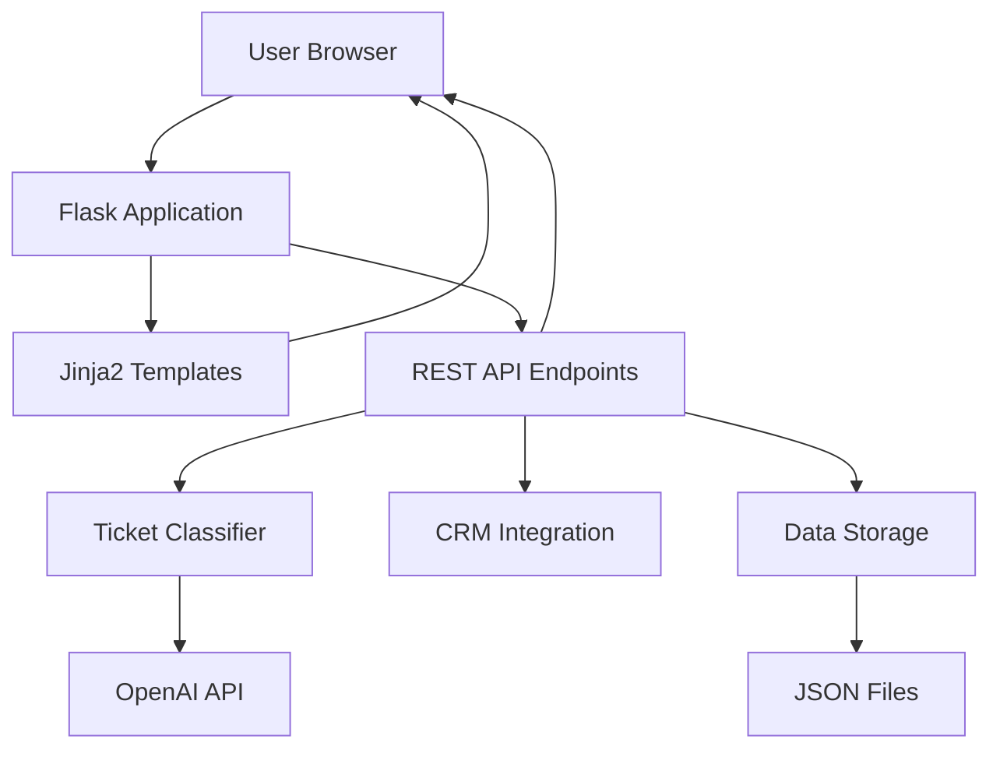
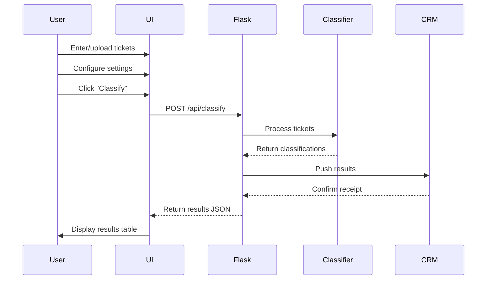
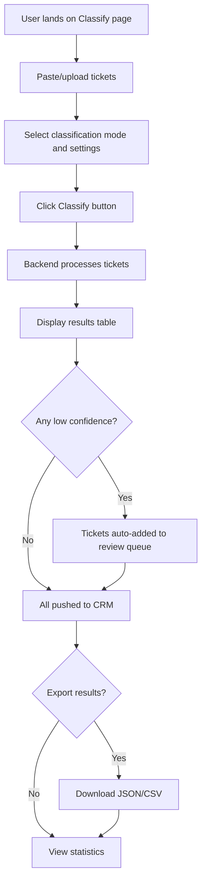
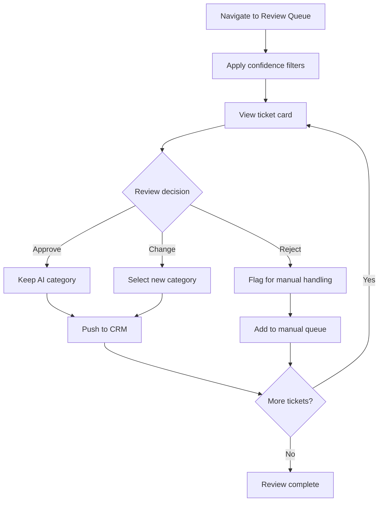
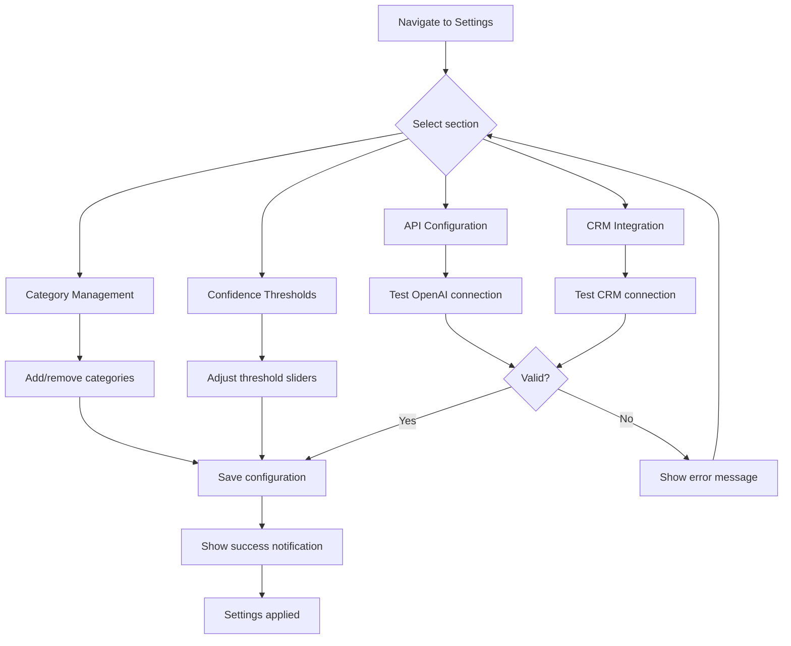

# Frontend Design: AI Ticket Classifier Web Interface

## Overview

Design a web-based user interface for the AI Ticket Classification system that enables users to classify customer support tickets, review flagged results, manage classification history, and configure CRM integration settings. The frontend will be integrated with the existing Python backend using Flask to serve HTML templates and provide API endpoints.

## Design Goals

- Provide an intuitive, modern interface for ticket classification
- Enable review and approval workflow for low-confidence classifications
- Display real-time statistics and classification insights
- Allow configuration of CRM integration and system settings
- Maintain simplicity using vanilla HTML, CSS, and JavaScript without frontend frameworks

## System Architecture

### High-Level Component Structure

| Component | Responsibility | Technology |
|-----------|---------------|------------|
| Flask Web Server | Serve HTML templates, handle HTTP requests, route API calls | Python Flask |
| HTML Templates | Page structure and layout | Jinja2 templates |
| CSS Styling | Visual design, responsive layout, animations | Vanilla CSS with CSS Grid/Flexbox |
| JavaScript Client | Dynamic interactions, AJAX calls, real-time updates | Vanilla JavaScript (ES6+) |
| Backend Integration | Classification logic, CRM push, data persistence | Existing Python modules |

### Request Flow



## Page Structure

### 1. Main Dashboard (Home Page)

**Purpose**: Entry point providing overview and quick actions

**Visual Layout**:
- Header with application logo and navigation menu
- Hero section with quick classification form (paste/type tickets)
- Statistics cards showing:
  - Total tickets processed today/this week
  - Average confidence score
  - Tickets pending review
  - Success rate of CRM pushes
- Recent activity feed (last 10 classifications)

**Key Elements**:

| Element | Description | Interaction |
|---------|-------------|-------------|
| Quick Classify Form | Text area for single/multiple tickets | Submit triggers classification |
| Batch Upload | File upload button for CSV/TXT files | Parses and queues tickets |
| Statistics Cards | Real-time metrics with icons | Click to view detailed breakdown |
| Activity Feed | List of recent tickets with status badges | Click ticket to view details |

### 2. Classify Tickets Page

**Purpose**: Primary interface for ticket classification with bulk processing

**Visual Layout**:
- Left panel: Input area
  - Multi-line text area for ticket entry
  - Option to add individual tickets (one per line or separated)
  - File upload zone with drag-and-drop support
  - Mode selector (OpenAI API / Mock Classifier)
- Right panel: Configuration
  - Category selection (enable/disable categories)
  - Confidence threshold adjusters
  - Output format toggle (simple/detailed)
  - CRM mode selector

**Workflow**:



**Results Display**:
- Table with columns:
  - Ticket ID (auto-generated)
  - Content preview (truncated, expandable)
  - Category (color-coded badge)
  - Confidence score (progress bar)
  - Status (Success/Pending Review/Failed)
  - Actions (View details, Edit category, Flag for review)
- Filtering and sorting controls
- Export buttons (JSON, CSV)

### 3. Review Queue Page

**Purpose**: Manage tickets flagged for human review

**Visual Layout**:
- Filter tabs:
  - All pending reviews
  - Low confidence (< 0.50)
  - Medium confidence (0.50 - 0.70)
  - Failed classifications
- Ticket cards displaying:
  - Full ticket content
  - AI-suggested category with confidence
  - Alternative category suggestions
  - Reasoning explanation
  - Review actions (Approve, Change Category, Reject)

**Review Workflow**:

| User Action | System Behavior | Next State |
|-------------|----------------|------------|
| Approve | Accept AI classification, push to CRM | Removed from queue |
| Change Category | Update category, push to CRM | Removed from queue |
| Reject | Move to manual processing queue | Flagged for human agent |
| Bulk Approve | Apply to all selected tickets | Batch CRM push |

**Interactive Elements**:
- Category dropdown with search/filter
- Confidence override input
- Notes text area for reviewer comments
- Batch selection checkboxes
- "Learn from this" button (for future AI training)

### 4. History & Analytics Page

**Purpose**: View past classifications and performance metrics

**Visual Sections**:

**Statistics Dashboard**:
- Time-based filters (Today, Week, Month, All Time)
- Key metrics:
  - Total tickets classified
  - Category distribution (pie chart)
  - Confidence score distribution (histogram)
  - Review rate (percentage needing review)
  - CRM push success rate

**Category Breakdown Table**:

| Category | Count | Avg Confidence | Review Rate | CRM Success |
|----------|-------|----------------|-------------|-------------|
| Billing | 45 | 0.89 | 5% | 100% |
| Technical Issue | 67 | 0.82 | 15% | 98% |
| Sales Inquiry | 23 | 0.91 | 2% | 100% |
| Other | 12 | 0.55 | 60% | 95% |

**Classification History Table**:
- Searchable and filterable list
- Columns: Timestamp, Ticket ID, Content preview, Category, Confidence, Status
- Pagination (50 items per page)
- Click row to expand full details

**Data Visualization**:
- Category distribution pie chart
- Confidence trend line over time
- Daily classification volume bar chart
- Review queue size over time

### 5. Settings Page

**Purpose**: Configure system behavior and CRM integration

**Configuration Sections**:

**API Configuration**:
- OpenAI API Key input (masked, validate on save)
- Model selector dropdown (gpt-4o-mini, gpt-4, etc.)
- Temperature slider (0.0 - 1.0)
- Test connection button

**Category Management**:
- List of current categories with enable/disable toggles
- Add custom category form
- Reorder categories (drag-and-drop)
- Delete category with confirmation

**Confidence Thresholds**:

| Threshold | Default | Purpose | Input Type |
|-----------|---------|---------|------------|
| High Confidence | 0.85 | Auto-route without review | Slider (0.0-1.0) |
| Medium Confidence | 0.70 | Flag for review but process | Slider (0.0-1.0) |
| Low Confidence | 0.50 | Require human verification | Slider (0.0-1.0) |

**CRM Integration**:
- Mode selector: Mock / Mock-HTTP / Real
- Real endpoint URL input (enabled when mode = Real)
- Simulated delay input (for Mock-HTTP mode)
- Failure rate slider (for testing error handling)
- Test CRM connection button
- Authentication settings (API key/token for real mode)

**Output Preferences**:
- Default output format toggle (Simple/Detailed)
- Auto-export enabled checkbox
- Export format selector (JSON/CSV)
- Email notifications toggle

## Data Models

### Ticket Display Object

```
Ticket {
  id: string (auto-generated, e.g., "TKT-001")
  content: string (original text)
  category: string (classification result)
  confidence: number (0.0 to 1.0)
  reasoning: string (AI explanation)
  alternative_category: string | null
  requires_review: boolean
  timestamp: datetime (ISO 8601)
  crm_status: string ("success" | "pending" | "failed")
  crm_id: string | null (CRM system ticket ID)
  reviewed_by: string | null (username if manually reviewed)
  review_notes: string | null
}
```

### Classification Request

```
ClassificationRequest {
  tickets: array of strings (ticket contents)
  use_real_api: boolean (true for OpenAI, false for mock)
  categories: array of strings (enabled categories)
  confidence_threshold: number
  output_format: string ("simple" | "detailed")
  crm_mode: string ("mock" | "mock-http" | "real")
}
```

### Statistics Summary

```
Statistics {
  total_tickets: number
  period: string ("today" | "week" | "month" | "all")
  category_distribution: object { category: count }
  average_confidence: number
  review_rate: number (percentage)
  crm_success_rate: number (percentage)
  high_confidence_count: number
  medium_confidence_count: number
  low_confidence_count: number
}
```

## API Endpoints

### Classification Endpoints

| Endpoint | Method | Purpose | Request Body | Response |
|----------|--------|---------|--------------|----------|
| /api/classify | POST | Classify single/batch tickets | ClassificationRequest | Array of Ticket objects |
| /api/tickets | GET | Retrieve ticket history | Query params: limit, offset, filter | Paginated ticket list |
| /api/tickets/:id | GET | Get single ticket details | None | Ticket object |
| /api/tickets/:id | PUT | Update ticket (manual review) | Updated Ticket fields | Updated Ticket |

### Review Queue Endpoints

| Endpoint | Method | Purpose | Request Body | Response |
|----------|--------|---------|--------------|----------|
| /api/review-queue | GET | Get pending review tickets | Query params: confidence_filter | Array of Tickets |
| /api/review-queue/:id/approve | POST | Approve classification | { notes: string } | Success status |
| /api/review-queue/:id/update | POST | Change category | { category: string, confidence: number, notes: string } | Updated Ticket |
| /api/review-queue/batch-approve | POST | Approve multiple tickets | { ticket_ids: array } | Success status |

### Statistics Endpoints

| Endpoint | Method | Purpose | Request Body | Response |
|----------|--------|---------|--------------|----------|
| /api/statistics | GET | Get classification statistics | Query params: period | Statistics object |
| /api/statistics/export | POST | Export data | { format: string, filters: object } | File download |

### Configuration Endpoints

| Endpoint | Method | Purpose | Request Body | Response |
|----------|--------|---------|--------------|----------|
| /api/config | GET | Get current configuration | None | Config object |
| /api/config | PUT | Update configuration | Partial config object | Updated config |
| /api/config/test-openai | POST | Test OpenAI connection | { api_key: string } | Success/error status |
| /api/config/test-crm | POST | Test CRM connection | { mode: string, endpoint: string } | Success/error status |

## UI Design Principles

### Visual Design

**Color Scheme**:
- Primary: Blue (#2563eb) - Actions, links, primary buttons
- Success: Green (#10b981) - High confidence, successful operations
- Warning: Yellow (#f59e0b) - Medium confidence, needs attention
- Danger: Red (#ef4444) - Low confidence, errors, failures
- Neutral: Gray scale (#f9fafb to #111827) - Backgrounds, text, borders

**Typography**:
- Headings: System font stack (sans-serif) - Bold, clear hierarchy
- Body text: 16px base size for readability
- Code/Data: Monospace font for ticket IDs, JSON output

**Spacing**:
- Consistent 8px grid system
- Generous padding for cards and sections
- Clear visual separation between functional areas

### Responsive Behavior

**Breakpoints**:
- Mobile: < 640px (single column, collapsible sections)
- Tablet: 640px - 1024px (two-column where appropriate)
- Desktop: > 1024px (full multi-column layout)

**Mobile Adaptations**:
- Navigation menu collapses to hamburger icon
- Statistics cards stack vertically
- Tables convert to card-based layout
- Side panels become full-screen overlays

### Interactive Feedback

**Loading States**:
- Skeleton loaders for data-heavy components
- Spinner indicators for API calls
- Progress bars for batch operations
- Disable buttons during processing

**Success/Error Notifications**:
- Toast notifications for actions (auto-dismiss after 3 seconds)
- Inline validation messages for forms
- Banner alerts for system-wide issues
- Confirmation modals for destructive actions

**Accessibility**:
- ARIA labels for screen readers
- Keyboard navigation support (Tab, Enter, Escape)
- High contrast mode support
- Focus indicators on interactive elements

## Data Persistence Strategy

### Storage Mechanism

Use JSON file-based storage for simplicity and alignment with existing Python architecture:

**File Structure**:
```
data/
├── tickets.json          # All classified tickets
├── review_queue.json     # Tickets pending review
├── statistics.json       # Aggregated metrics cache
└── config.json          # User configuration preferences
```

**Data Operations**:

| Operation | Implementation | Performance Consideration |
|-----------|----------------|--------------------------|
| Save ticket | Append to tickets.json | Lock file during write |
| Query history | Load and filter in memory | Implement pagination for large datasets |
| Update ticket | Read, modify, write back | Consider atomic file operations |
| Generate stats | Cache in statistics.json, regenerate hourly | Balance freshness vs. computation cost |

**Backup Strategy**:
- Daily rotation of data files (keep last 7 days)
- Export functionality allows manual backups
- Consider migration to SQLite if dataset grows beyond 10,000 tickets

## Integration with Existing Backend

### Flask Application Structure

```
Flask app/
├── app.py                 # Main Flask application
├── routes/
│   ├── web.py            # HTML page routes
│   └── api.py            # REST API endpoints
├── templates/
│   ├── base.html         # Base template with common elements
│   ├── dashboard.html    # Home page
│   ├── classify.html     # Classification page
│   ├── review.html       # Review queue
│   ├── history.html      # Analytics and history
│   └── settings.html     # Configuration page
└── static/
    ├── css/
    │   └── styles.css    # All CSS styles
    ├── js/
    │   ├── main.js       # Common JavaScript utilities
    │   ├── classify.js   # Classification page logic
    │   ├── review.js     # Review queue logic
    │   └── charts.js     # Data visualization
    └── assets/
        └── icons/        # SVG icons and images
```

### Backend Module Integration

**Reuse Existing Modules**:
- Import `ticket_classifier.py` for OpenAIClassifier and MockClassifier
- Import `crm_integration.py` for CRMIntegration
- Import `utils.py` for Ticket class and helper functions
- Import `config.py` for configuration values

**New Backend Components**:

| Component | Purpose | Key Functions |
|-----------|---------|--------------|
| data_manager.py | Handle JSON file operations | load_tickets(), save_ticket(), get_statistics() |
| api_handlers.py | Process API requests, format responses | classify_handler(), review_handler() |
| session_manager.py | Track user sessions and preferences | get_user_config(), update_user_config() |

### State Management

**Session Data** (stored in Flask session):
- User configuration overrides
- Current filter/sort preferences
- Pagination state
- Active mode (mock/real)

**Application State** (in-memory cache):
- Recently classified tickets (last 100)
- Statistics cache (refreshed every 5 minutes)
- Active review queue snapshot

## User Workflows

### Workflow 1: Classify New Tickets



### Workflow 2: Review Flagged Tickets



### Workflow 3: Configure System Settings



## Performance Considerations

### Optimization Strategies

| Aspect | Strategy | Implementation |
|--------|----------|----------------|
| Page Load | Minimize initial payload | Load JavaScript modules on demand |
| API Calls | Debounce user input | Wait 300ms before triggering search/filter |
| Large Datasets | Implement pagination | Limit to 50 items per page |
| Charts | Use lightweight libraries | Consider Chart.js or vanilla SVG |
| File Uploads | Process in chunks | Stream large CSV files |
| Statistics | Cache computed metrics | Regenerate only when new data arrives |

### Expected Performance Targets

- Initial page load: < 2 seconds
- Classification of 10 tickets: < 5 seconds (with OpenAI API)
- Statistics dashboard refresh: < 1 second
- Review queue loading: < 500ms for 50 tickets
- Configuration save: < 200ms

## Security Considerations

### Input Validation

**Client-Side**:
- Sanitize all text inputs before display
- Validate file uploads (type, size limits)
- Prevent XSS through proper escaping

**Server-Side**:
- Validate all API request parameters
- Enforce maximum ticket content length
- Rate limit classification requests

### Authentication & Authorization

**Phase 1 (Current Scope)**:
- Single-user application (no authentication required)
- API key stored server-side in environment variables
- Configuration changes require page access

**Future Considerations**:
- Add user authentication for multi-user scenarios
- Role-based access (Admin, Reviewer, Viewer)
- API key management per user

### Data Protection

- Store sensitive configuration (API keys) in environment variables
- Never expose API keys in client-side code
- Implement HTTPS for production deployment
- Sanitize ticket content before storage to prevent injection

## Error Handling Strategy

### User-Facing Error Messages

| Error Type | User Message | Recovery Action |
|------------|--------------|-----------------|
| OpenAI API failure | "Classification service unavailable. Try mock mode or retry later." | Offer mock mode toggle |
| CRM connection failure | "Unable to push to CRM. Results saved locally for retry." | Queue for retry |
| Invalid API key | "OpenAI API key invalid or missing. Please update in Settings." | Link to settings page |
| File upload error | "File format not supported. Please upload CSV or TXT files." | Show supported formats |
| Network timeout | "Request timed out. Please try again." | Retry button |

### Error Recovery Patterns

**Graceful Degradation**:
- If OpenAI fails, offer mock classifier option
- If CRM push fails, store results and allow manual retry
- If statistics fail to load, show last cached version

**User Guidance**:
- Provide clear next steps in error messages
- Include links to relevant settings or help documentation
- Log errors for debugging (visible in browser console)

## Testing Strategy

### Manual Testing Checklist

**Functional Testing**:
- Classify single ticket with OpenAI API mode
- Classify batch of tickets with mock mode
- Upload CSV file with 50+ tickets
- Review and approve low-confidence ticket
- Change category for flagged ticket
- Export results to JSON and CSV
- Update configuration settings
- Test CRM connection in all modes

**UI/UX Testing**:
- Verify responsive layout on mobile, tablet, desktop
- Test keyboard navigation through all pages
- Validate form inputs with invalid data
- Verify loading states appear during long operations
- Check error messages display correctly
- Confirm success notifications auto-dismiss

**Browser Compatibility**:
- Test on Chrome, Firefox, Safari, Edge
- Verify CSS grid/flexbox layouts work correctly
- Ensure JavaScript ES6 features are supported

### Data Validation Tests

- Submit empty ticket content (should show error)
- Submit extremely long ticket (should truncate or warn)
- Upload invalid file format (should reject)
- Set invalid confidence thresholds (should validate)
- Test with special characters and unicode in tickets

## Deployment Considerations

### Development Environment

**Local Setup**:
1. Install Flask: `pip install flask`
2. Create templates and static folders
3. Run development server: `flask run --debug`
4. Access at `http://localhost:5000`

**Hot Reload**:
- Flask debug mode enables auto-reload on file changes
- Browser live reload for CSS/JS during development

### Production Deployment

**Recommended Approach**:
- Use production WSGI server (Gunicorn or uWSGI)
- Serve static files through Nginx
- Enable HTTPS with SSL certificate
- Set environment variables for production configuration

**Containerization** (Optional):
- Create Dockerfile for Flask application
- Include all dependencies and static assets
- Expose port 5000 or configured port
- Mount data directory as volume for persistence

### Environment Configuration

**Development (.env)**:
```
FLASK_ENV=development
FLASK_DEBUG=True
OPENAI_API_KEY=your-key-here
CRM_MODE=mock
```

**Production (.env.production)**:
```
FLASK_ENV=production
FLASK_DEBUG=False
OPENAI_API_KEY=production-key
CRM_MODE=real
CRM_REAL_ENDPOINT=https://crm.company.com/api/tickets
```

## Future Enhancement Opportunities

### Phase 2 Features

**Advanced Classification**:
- Multi-language support with language detection
- Custom category creation and management via UI
- Fine-tuning suggestions based on review feedback
- Confidence threshold auto-adjustment based on accuracy

**Collaboration Features**:
- Multi-user support with role-based access
- Assignment of tickets to specific reviewers
- Comment threads on tickets
- Audit trail of all changes

**Analytics Enhancements**:
- Custom date range selection for statistics
- Export scheduled reports
- Trend analysis and forecasting
- AI accuracy improvement tracking

**Integration Expansion**:
- Direct integration with real CRM systems (Salesforce, HubSpot)
- Email integration to automatically ingest tickets
- Webhook notifications for ticket events
- Slack/Teams notifications for review queue

### Technical Improvements

**Performance**:
- Migrate to SQLite or PostgreSQL for better query performance
- Implement Redis caching for statistics
- Add background job processing with Celery
- Optimize frontend with bundling and minification

**User Experience**:
- Dark mode theme toggle
- Customizable dashboard widgets
- Saved filter presets
- Keyboard shortcuts for power users

**DevOps**:
- Automated testing suite
- CI/CD pipeline for deployments
- Monitoring and alerting
- Backup automation