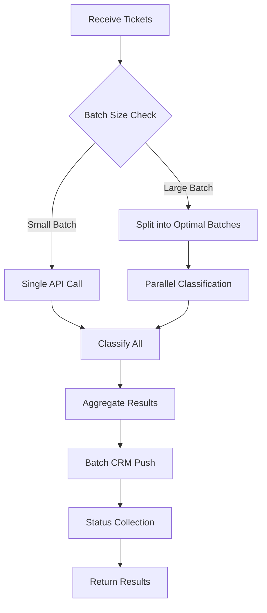

# Improvement Design: AI Ticket Classifier Alignment with Problem Statement

## Context

The current implementation successfully delivers a functional AI-powered ticket classification system. However, reviewing against the original Problem Statement reveals opportunities to better align with the interview exercise requirements while enhancing production-readiness.

### Current State Analysis

The existing system demonstrates:
- Strong modular OOP architecture with clear separation of concerns
- Dual-mode operation supporting both real OpenAI API and mock classification
- Comprehensive error handling and validation
- Batch processing capabilities with statistics tracking
- Full unit test coverage
- CLI interface with export functionality

### Gap Analysis Against Problem Statement

| Problem Statement Requirement | Current Implementation | Alignment Status |
|------------------------------|------------------------|------------------|
| Accept list of customer support tickets | Fully supported via CLI and function parameters | Aligned |
| Classify into predefined categories | Implemented with configurable categories | Aligned |
| Simulate CRM endpoint push | Mock implementation exists | Partially aligned - could be more realistic |
| Clean, readable output | Rich formatted output with emojis and statistics | Over-engineered for 60-90 min exercise |
| Code quality and modularity | Excellent separation, well-documented | Aligned |
| AI API integration | Proper OpenAI integration with error handling | Aligned |
| Testing and validation | Comprehensive unit tests | Exceeds requirements |
| Stretch goal: CLI | Implemented with argparse | Aligned |
| Stretch goal: Handle ambiguous tickets | Basic "Other" category fallback | Could be enhanced |

## Proposed Improvements

### 1. Simplify Output Format to Match Problem Statement

**Objective**: Align output format with the example provided in the Problem Statement for better interview presentation clarity.

**Current Behavior**:
The system produces elaborate output with emojis, progress indicators, formatted boxes, and detailed statistics that, while professional, exceeds the simplicity requested in the interview prompt.

**Proposed Change**:
Introduce an output mode that matches the Problem Statement example format while retaining the detailed mode as an option.

**Design**:

Output format configuration should support two modes:

| Mode | Description | Use Case |
|------|-------------|----------|
| Simple | Matches Problem Statement example format exactly | Interview demonstration, quick validation |
| Detailed | Current rich formatting with statistics | Development, debugging, production monitoring |

Simple mode output structure per ticket:
```
Ticket: "[ticket content]"
Category: [category name]
Pushed to CRM endpoint: [Success/Failed]
```

The mode selection should be controlled through:
- CLI flag for explicit control
- Environment variable for persistent preference
- Configuration file setting for team standards

### 2. Enhance CRM Simulation Realism

**Objective**: Make the mock CRM integration more representative of real-world API interactions.

**Current Limitation**:
The CRM simulation stores results in memory without demonstrating typical HTTP request patterns, error scenarios, or realistic latency behaviors that would occur in production.

**Proposed Enhancement**:

The CRM integration should support multiple simulation modes:

| Simulation Mode | Behavior | Purpose |
|----------------|----------|---------|
| Mock In-Memory | Current behavior - instant success, no network | Unit testing, fast iteration |
| Mock HTTP | Simulates HTTP requests with requests library, no actual endpoint | Integration testing, demonstration |
| Real Endpoint | Actual HTTP POST to configurable CRM endpoint | Production use |

Mock HTTP mode characteristics:
- Simulates realistic response times through configurable delays
- Demonstrates proper HTTP request construction with headers, authentication patterns
- Supports error scenario simulation including network failures, timeouts, rate limiting, server errors
- Logs request/response details for debugging and demonstration purposes
- Maintains compatibility with requests library patterns for easy transition to real endpoints

Error scenario configuration should include:
- Random failure rate percentage for testing resilience
- Specific status code injection for testing error handling paths
- Timeout simulation for testing async behavior
- Retry logic demonstration

### 3. Improved Ambiguous Ticket Handling

**Objective**: Better address the stretch goal of handling unclear or ambiguous tickets.

**Current Approach**:
System defaults to "Other" category with fixed confidence threshold, providing limited insight into classification uncertainty.

**Proposed Enhancement**:

Ambiguous ticket handling strategy:

Confidence scoring approach:
- Classify tickets with confidence scores below threshold as requiring human review
- Support multiple confidence levels with different handling strategies
- Provide reasoning or explanation for low-confidence classifications

Confidence threshold tiers:

| Confidence Range | Category Assignment | Handling Strategy |
|------------------|---------------------|-------------------|
| Above 0.85 | Assigned with high confidence | Automatic routing to category team |
| 0.70 - 0.85 | Assigned with medium confidence | Automatic routing with review flag |
| 0.50 - 0.70 | Tentative assignment | Queue for human verification |
| Below 0.50 | Marked as ambiguous | Direct to human triage queue |

Enhanced classification output fields:
- Primary category with confidence score
- Secondary category suggestion when confidence is marginal
- Ambiguity flag for tickets requiring human review
- Reasoning snippet explaining classification basis when available

For OpenAI integration, leverage structured outputs to request:
- Primary category selection
- Confidence score reasoning
- Key phrases that influenced the decision
- Alternative category if primary is uncertain

### 4. Batch Processing Optimization

**Objective**: Improve efficiency for production scenarios with high-volume ticket processing.

**Current Approach**:
Sequential processing of tickets through both classification and CRM push operations.

**Proposed Enhancement**:

Multi-level batching strategy:

Classification batching:
- Process multiple tickets in single AI API call to reduce request overhead and cost
- Batch size should be configurable based on API limits and content length
- Implement request batching with size limits to prevent token overflow
- Support parallel processing for multiple batches when volume justifies

CRM push batching:
- Aggregate multiple tickets into batch CRM operations
- Support both individual push and bulk push endpoints
- Implement batch retry logic for failed submissions
- Provide batch-level and ticket-level status tracking

Processing flow optimization:



Rate limiting and retry strategy:
- Implement exponential backoff for API rate limits
- Track API quota consumption
- Support queue-based processing for sustained high volume
- Provide progress tracking for long-running batch operations

### 5. Structured Logging and Observability

**Objective**: Replace print statements with proper logging infrastructure for production readiness.

**Current Approach**:
Direct print statements throughout the codebase for user feedback and debugging.

**Proposed Enhancement**:

Structured logging framework:

Log level strategy:

| Level | Usage | Examples |
|-------|-------|----------|
| DEBUG | Development diagnostics, detailed API interactions | Raw API requests/responses, intermediate processing steps |
| INFO | Normal operation tracking, workflow progress | Tickets received, classification started, CRM push completed |
| WARNING | Recoverable issues, degraded operation | Low confidence classification, retry attempts, fallback usage |
| ERROR | Operation failures requiring attention | API errors, CRM push failures, invalid input |
| CRITICAL | System-level failures | Authentication failures, service unavailability |

Logging output format should support:
- JSON structured logs for machine parsing and analysis tools
- Human-readable console output for development
- Contextual information including ticket IDs, timestamps, operation types
- Correlation IDs for tracking tickets through the entire workflow

Observability features:
- Metrics collection for classification accuracy, processing time, error rates
- Performance tracking for AI API latency and CRM response times
- Error aggregation by type and frequency
- Success rate monitoring with alerting thresholds

### 6. Configuration Flexibility

**Objective**: Enhance configuration management for different deployment environments.

**Current Approach**:
Single configuration file with environment variable support for API key only.

**Proposed Enhancement**:

Configuration hierarchy with precedence:

1. Command-line arguments - highest precedence for immediate overrides
2. Environment variables - container and cloud deployment configuration
3. Configuration file - team and project defaults
4. Hardcoded defaults - fallback values

Configuration categories:

| Category | Parameters | Purpose |
|----------|------------|---------|
| AI Model | Model name, temperature, max tokens, timeout | Control classification behavior and cost |
| Categories | Category list, confidence thresholds per category | Customize classification taxonomy |
| CRM Integration | Endpoint URL, authentication, timeout, retry settings | Configure external service connection |
| Processing | Batch size, parallel workers, rate limits | Optimize throughput and resource usage |
| Output | Format mode, verbosity level, export settings | Control user interface and reporting |
| Logging | Level, format, destination, rotation | Manage observability infrastructure |

Configuration file format should support:
- YAML or TOML for human-friendly editing
- Environment-specific overlays for dev/staging/production
- Validation on load with clear error messages for invalid settings
- Schema documentation for all available parameters

### 7. Enhanced Testing Strategy

**Objective**: Expand test coverage to include integration and performance testing scenarios.

**Current State**:
Comprehensive unit tests covering individual components.

**Proposed Enhancement**:

Multi-tier testing approach:

Unit tests (existing):
- Continue testing individual components in isolation
- Mock external dependencies completely
- Fast execution for development feedback

Integration tests (new):
- Test complete workflow from ticket input to CRM push
- Use mock HTTP server for CRM endpoint
- Validate end-to-end data flow and transformations
- Test error propagation through the system

Contract tests (new):
- Validate OpenAI API integration against actual API behavior
- Test CRM payload format expectations
- Ensure backward compatibility when upgrading dependencies

Performance tests (new):
- Benchmark classification throughput for different batch sizes
- Measure API latency under various network conditions
- Validate memory usage for large ticket volumes
- Test parallel processing scalability

Test scenarios to add:

| Scenario Type | Example Tests |
|--------------|---------------|
| Edge Cases | Empty tickets, extremely long content, special characters, non-English text |
| Error Recovery | API timeout handling, partial batch failures, network interruptions |
| Concurrency | Parallel classification correctness, thread safety, resource contention |
| Performance | Processing time for 100/1000/10000 tickets, memory footprint scaling |
| Security | Input validation, injection prevention, credential handling |

### 8. Documentation Improvements

**Objective**: Enhance documentation to support interview discussion and production deployment.

**Proposed Additions**:

Architecture decision records:
- Document why specific design choices were made
- Explain trade-offs between alternative approaches
- Provide context for technology selection

Production deployment guide:
- Infrastructure requirements and recommendations
- Scaling considerations and bottlenecks
- Monitoring and alerting setup
- Security hardening checklist
- Disaster recovery procedures

API integration guide:
- How to add support for additional AI providers
- Custom category configuration examples
- CRM endpoint integration patterns
- Authentication and authorization setup

Troubleshooting guide:
- Common error scenarios and resolutions
- Performance optimization techniques
- Debugging tips for classification accuracy issues
- API quota management strategies

## Implementation Priorities

### Phase 1: Core Alignment (Highest Priority)
Focus on aligning with Problem Statement requirements and improving interview presentation.

1. Implement simplified output format matching Problem Statement example
2. Enhance CRM mock realism with HTTP simulation mode
3. Improve ambiguous ticket handling with confidence thresholds

Expected outcomes:
- System output directly matches interview exercise expectations
- Better demonstration of production-ready patterns
- Enhanced discussion points for post-coding interview

### Phase 2: Production Readiness
Transition from interview exercise to deployable system.

4. Replace print statements with structured logging
5. Implement configuration hierarchy
6. Add batch processing optimization

Expected outcomes:
- System suitable for production deployment
- Improved performance at scale
- Better operational observability

### Phase 3: Quality and Robustness
Enhance reliability and maintainability.

7. Expand test coverage with integration and performance tests
8. Complete documentation suite
9. Add monitoring and metrics collection

Expected outcomes:
- Increased confidence in system reliability
- Reduced operational burden
- Easier onboarding for new team members

## Success Criteria

Each improvement should be validated against these criteria:

| Criterion | Measurement |
|-----------|-------------|
| Problem Statement Alignment | Output format matches example, all requirements explicitly addressed |
| Code Quality | Maintains or improves current modularity and readability |
| Performance | No degradation in processing time for typical workloads |
| Backward Compatibility | Existing functionality remains available, new features are opt-in |
| Test Coverage | New code has equivalent or better test coverage than existing |
| Documentation | All new features have usage examples and design rationale |

## Discussion Points for Interview

These improvements enable richer conversation during the post-coding discussion:

**Architecture and Design**:
- Trade-offs between simplicity and feature richness
- When to abstract vs. when to keep it simple
- Designing for both demonstration and production use

**Scalability Considerations**:
- Batch processing strategies and their cost/latency implications
- Rate limiting and quota management approaches
- Horizontal scaling patterns for high-volume scenarios

**Production Readiness**:
- Observability requirements for AI-powered systems
- Error handling strategies for external service dependencies
- Configuration management across deployment environments

**AI Integration Patterns**:
- Handling model uncertainty and confidence scoring
- Prompt engineering for consistent classification
- Multi-provider support and fallback strategies

**System Evolution**:
- How to extend to additional categories or classification dimensions
- Integration with broader support ticket management systems
- Potential for active learning and model improvement loops

## Technical Considerations

### Backward Compatibility Strategy

All improvements should maintain backward compatibility:
- Existing CLI commands continue to work unchanged
- New features are opt-in through flags or configuration
- Default behavior matches current system unless explicitly overridden
- Deprecation warnings for any behavior changes

### Performance Impact Assessment

Each enhancement should be evaluated for performance implications:

| Improvement | Expected Impact | Mitigation |
|-------------|----------------|------------|
| Simplified output | Minimal - less string formatting | None needed |
| HTTP mock simulation | Minor - adds delay simulation | Make delays configurable, default to fast |
| Enhanced ambiguity handling | Minor - additional AI API fields | Use structured outputs efficiently |
| Batch processing | Positive - reduced API calls | None needed |
| Structured logging | Minor - additional processing | Use lazy evaluation, async logging |
| Enhanced configuration | Minimal - one-time load operation | None needed |

### Security Considerations

Security enhancements to include:

- Input validation and sanitization for all ticket content
- API key protection through environment variables and secrets management
- Secure credential storage patterns for CRM authentication
- Rate limiting to prevent abuse
- Audit logging for compliance requirements
- Data privacy considerations for ticket content handling

### Error Handling Philosophy

Consistent error handling approach across improvements:

- Fail fast with clear error messages for configuration issues
- Graceful degradation for external service failures
- Detailed error context for debugging without exposing sensitive data
- Retry logic with exponential backoff for transient failures
- User-friendly error messages that suggest corrective actions
- Structured error responses that can be programmatically handled

## Alternative Approaches Considered

### Alternative 1: Complete Rewrite for Simplicity
Simplify the entire codebase to match only the minimal Problem Statement requirements.

**Pros**: Perfectly aligned with 60-90 minute exercise scope, easier to explain quickly
**Cons**: Loses production-ready features, reduces discussion depth, doesn't showcase advanced capabilities
**Decision**: Rejected - Instead, add simple output mode while preserving advanced features

### Alternative 2: Microservices Architecture
Split into separate services for classification, CRM integration, and orchestration.

**Pros**: More realistic production architecture, demonstrates distributed systems knowledge
**Cons**: Over-engineered for the problem scope, adds complexity that distracts from AI integration focus
**Decision**: Rejected - Keep modular monolith, document how to evolve to microservices

### Alternative 3: Real CRM Integration
Integrate with actual CRM system like Salesforce or HubSpot.

**Pros**: Demonstrates real integration capability, more impressive in interview
**Cons**: Requires external account setup, adds dependencies outside interviewer control, complicates testing
**Decision**: Rejected - Enhance mock realism instead, provide clear path to real integration

### Alternative 4: Multiple AI Provider Support
Add support for Anthropic, Google, Azure OpenAI, etc.

**Pros**: Demonstrates abstraction skills, reduces vendor lock-in, enables cost optimization
**Cons**: Increases complexity, requires multiple API keys, may distract from core functionality
**Decision**: Deferred - Design abstraction to support this, implement as future enhancement

## Migration Strategy

For teams already using the current implementation:

### Phase 1: Non-Breaking Additions
1. Add new output format as opt-in feature
2. Implement enhanced mock modes alongside existing
3. Deploy with feature flags disabled by default

### Phase 2: Gradual Enablement
4. Enable structured logging with compatibility mode
5. Introduce new configuration system with automatic migration
6. Document and communicate new capabilities

### Phase 3: Modernization
7. Deprecate old output format with migration period
8. Switch defaults to new recommended settings
9. Remove deprecated code paths after transition period

## Conclusion

These improvements transform the system from a strong interview exercise solution into a production-ready platform while maintaining clear alignment with the original Problem Statement requirements. The phased approach allows for incremental delivery of value, with each phase building upon previous work.

The design preserves the excellent modular architecture and code quality of the current implementation while addressing gaps identified in the Problem Statement alignment analysis. By implementing these enhancements, the system becomes both an exemplary interview demonstration and a solid foundation for production deployment.
